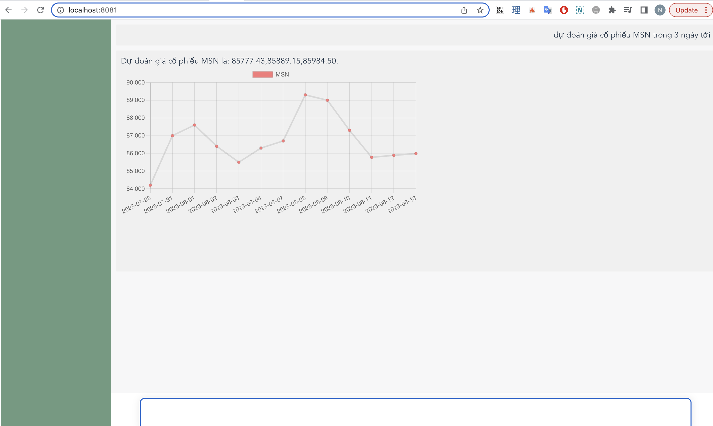

# Chatbot dùng tư vấn và dự đoán chỉ số chứng khoán



## Project setup
```
yarn install
```

### Run server front-end

```
yarn serve
```

### Compiles and minifies for production
```
yarn build
```

### Run server for API
```
python app.py
```
- APP dùng chatgpt API để phân tích câu hỏi của người dùng, trích xuất các keyword
mà mình đã quy định sẵn, dựa vào các keyword đó để call function tương ứng và trích xuất các câu trả lời tốt 
và ổn định nhất cho người dùng.

Reference:
- https://github.com/openai/openai-cookbook/blob/c651bfdda64ac049747c2a174cde1c946e2baf1d/examples/How_to_call_functions_with_chat_models.ipynb
- 