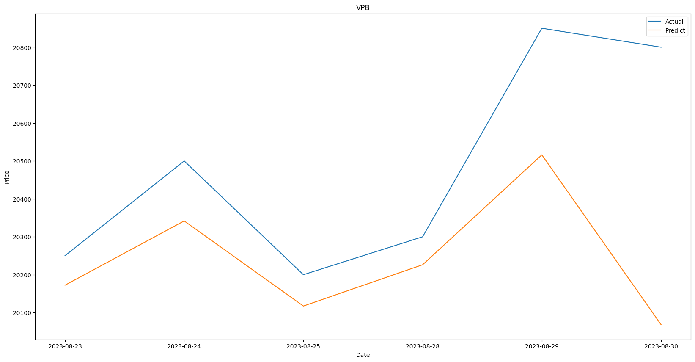

# Chatbot dùng tư vấn và dự đoán chỉ số chứng khoán


# Project setup
```
yarn install
```

- Run server front-end

```
yarn serve
```

- Compiles and minifies for production
```
yarn build
```

- Run server for API (Nó sẽ tự động tạo DB nếu chưa có)

```
python app.py
```

## Các chức năng chính của APP:

- APP dùng chatgpt API để phân tích câu hỏi của người dùng, trích xuất các keyword
mà mình đã quy định sẵn, dựa vào các keyword đó để call function tương ứng và trích xuất các câu trả lời tốt 
và ổn định nhất cho người dùng.

- APP dùng flask để tạo server API, vuejs là client.

- Các model sử dụng 
    - Chatgpt:
    - RNN:

Reference:
- https://github.com/openai/openai-cookbook/blob/c651bfdda64ac049747c2a174cde1c946e2baf1d/examples/How_to_call_functions_with_chat_models.ipynb


## Run cho crawl daily:
- Run notebook crawl_daily.ipynb (crawl toàn bộ dữ liệu cho tới khi trùng 1 cái trong DB (dùng url để làm indentity check)).
  
### Crawl vietstock:
- Tạo driver cho selenium rồi truyền vào class CrawlVietStock:

```
import crawl
driver = crawl.create_driver()
driver2 = crawl.create_driver()

vs = crawl.CrawlVietStock(driver=driver, driver2=driver2)
vs.run(fresh_start=True, daily=True)
```

- Vietstock có thể crawl dữ liệu theo range, nếu muốn crawl từ ngày A đến ngày B thì dùng option range_date:

```
vs.run(fresh_start=True, daily=True, range_date = {'start_date': '2022-01-01', 'end_date': '2022-10-01'})
```

## Cách dùng model regression giá stock:

- Train model: Training từ ngày 2022-01-01 đến 2023-08-22

```
bot = BotRegress('VPB', '2022-01-01', '2023-08-22')
bot.fit()
```

- Predict:

```
bot.predict('VPB', '2023-08-23', '2023-08-30')
```



### Các option nâng cao cho việc training:

```
bot = BotRegress('VPB', '2022-01-01', '2023-08-22', transform_type='tfidf', algorithm='randomforest')
bot.fit()
```

Ở đây chúng ta có 3 loại [transform_type]: tfidf, phobert, sequence. 

Các thuật toán regression gồm [algorithm]: randomforest, linear, svm, nbsvm, logistic, mlp.

Tham khảo notebook [algorithm/regress-deep-class.ipynb](algorithm/regress-deep-class.ipynb) để biết thêm chi tiết.

## Roadmap
- Predict bài viết đó thuộc về stock nào 
    + Giá bất động sản tăng cao => VIC: 0.9, PDR: 0.95, NVL: 1.0, TCH: 0.8
    + ....
